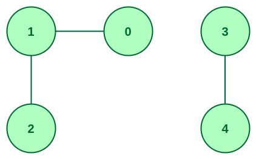

# Hayes-Graph-Analysis

## Challenge Question:
You're given a text file representing a network. The first line of the file is N, the number of nodes. You will name the nodes from 
0 through N-1. The remaining lines will have two integers per line, representing an edge. You don't know in advance how many edges 
there are, you just keep reading until you reach end of file. Your task is to compute and output the number of connected componets 
(you can ignore duplicate edges, but note that a node with degree zero counts as a connected component).

## Sample Input
```bash
5
1 0
4 3
2 1  
```

*image via [geeksforgeeks](https://media.geeksforgeeks.org/wp-content/uploads/20220905132251/graph.jpg)*
.jpg)
